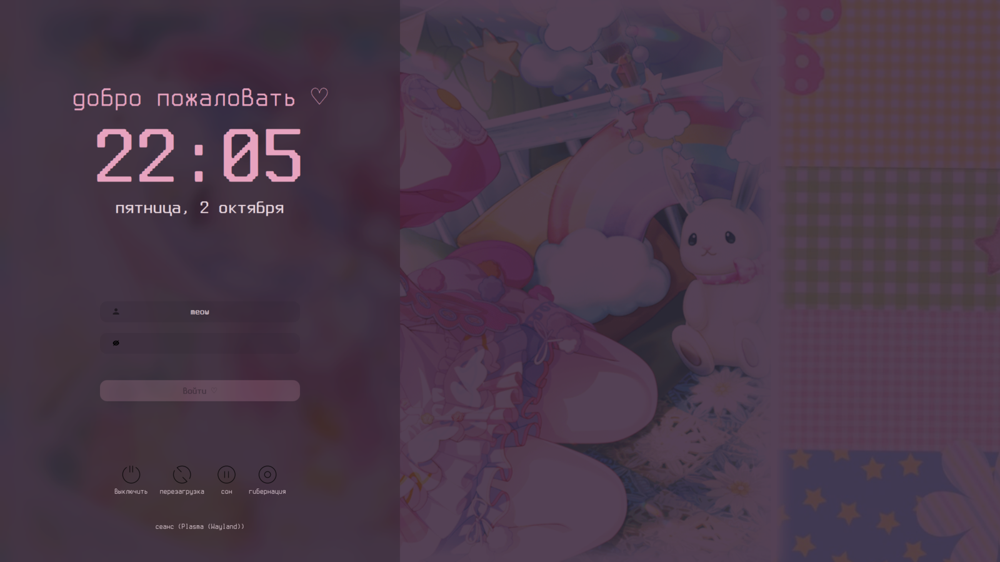

# Pinky rice ♡ KDE Plasma + niri

Тёмно-розовое оформление для **CachyOS / Arch**: KDE Plasma и niri в одном стиле,
плюс няшный экран входа SDDM, где можно выбрать любой из двух сеансов.



## Установка

```bash
git clone git@github.com:alenakhis07-star/Pinky-rice-kde-niri.git
cd Pinky-rice-kde-niri
./install.sh
```

Скрипт попросит пароль sudo (для пакетов и экрана входа). Дальше:

1. Перезагрузись.
2. На экране входа выбери **Plasma (Wayland)** и запусти в терминале `./install.sh --plasma`. Это применит тему, панели и сочетания клавиш KDE.
3. niri уже настроен — просто выбери **Niri** на экране входа.

Если оформление KDE когда-нибудь слетит (например, случайно сменилась глобальная тема) — снова `./install.sh --plasma`.

| Команда | Что делает |
|---|---|
| `./install.sh` | всё: пакеты, настройки, и если ты уже в KDE — сразу оформление |
| `./install.sh --user` | только файлы и настройки, без пакетов и sudo |
| `./install.sh --plasma` | только оформление KDE (внутри сеанса Plasma) |

Перед изменениями текущие настройки копируются в `~/.cache/pinky-rice-backup-…`.


## Сочетания клавиш (одинаковые в KDE и niri)

| Клавиши | Действие |
|---|---|
| Super+Enter / E / B / D | kitty / файлы / Firefox / запуск программ |
| Super+Q | закрыть окно |
| Super+F | во весь экран (в niri Ctrl+Super+F — развернуть до краёв) |
| Super+L | заблокировать |
| Super+V / Super+Shift+V | история буфера / очистить |
| Super+W | следующие обои |
| Super+Space | раскладка |
| Super+1…4, Super+Shift+1…4 | рабочий стол / перенести окно туда |
| Super+Ctrl+←/→ | соседний рабочий стол |
| Print | скриншот области |
| Ctrl+Alt+Del | меню сеанса (niri) / выход (KDE) |

Только в niri: Super+стрелки — фокус, Super+Alt+стрелки — двигать окна, Super+Shift+стрелки — другой монитор, Ctrl+Super+Shift+стрелки — перенести окно на другой монитор, Super+P — меню сеанса, Super+T — сделать окно плавающим и обратно, Super+O — обзор, Super+Shift+/ — все сочетания.

## Благодарности

- обои и цветовая схема-основа — [u/Commercial_Tap9279](https://www.reddit.com/r/unixporn/comments/1wpidy7/kde_plasma_my_pinky_linux_theme_3/)
- конфиги niri — [revaljonathan/val-niri](https://github.com/revaljonathan/val-niri)
- тема SDDM — [Keyitdev/sddm-astronaut-theme](https://github.com/Keyitdev/sddm-astronaut-theme) (GPL-3.0)
- курсор Мизуки — из [lezzthanthree/amiArch-Mizoox](https://github.com/lezzthanthree/amiArch-Mizoox)
- иконки — [Papirus](https://github.com/PapirusDevelopmentTeam/papirus-icon-theme) (розовые папки — [KDE Store](https://store.kde.org/p/1166289))
- шрифт — [Terminus TTF](https://files.ax86.net/terminus-ttf/) (SIL OFL)
